# 🚀 FiveM Start Web

🎯 FiveM 商业服务器专用官网

## ✨ 项目介绍

FiveM Start Web 是一个用于服务器官网的前端界面项目，主要用于：

- 展示服务器信息
- 显示公告 / 更新日志
- 提供视觉沉浸体验
- 提升服务器整体质感

适用于：
- RP服务器
- 商业服
- 内测服 / 宣传服
- 品牌化服务器

---

## 🖼️ 页面展示

### 登陆界面
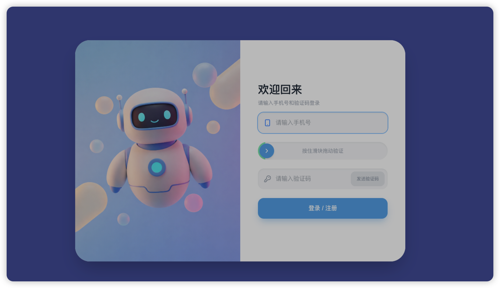

### 首页展示
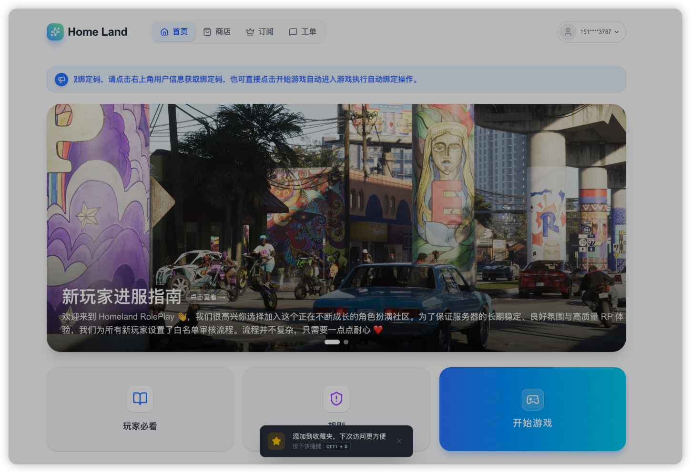
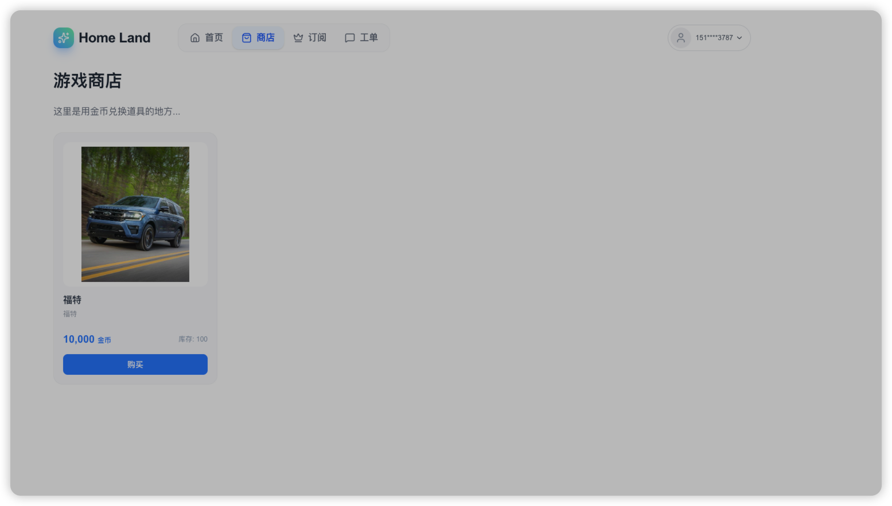
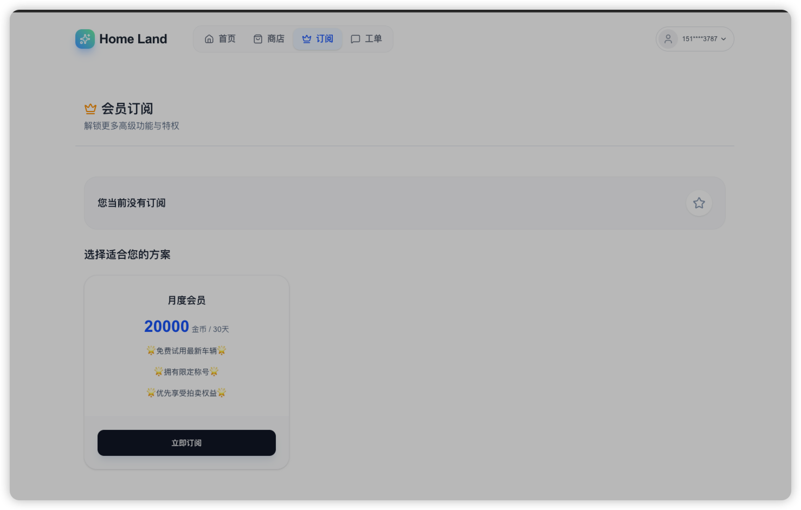
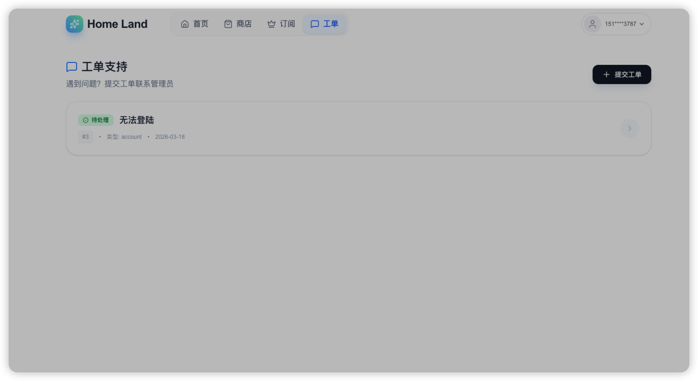
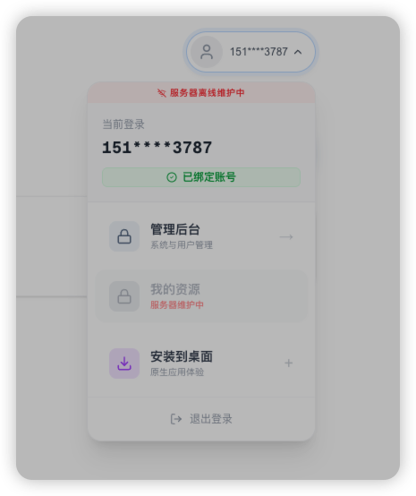


### 管理界面
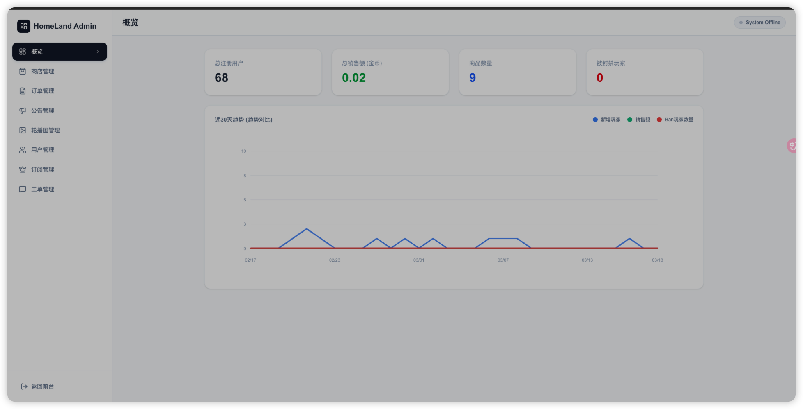
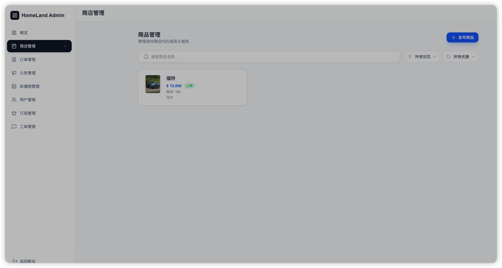
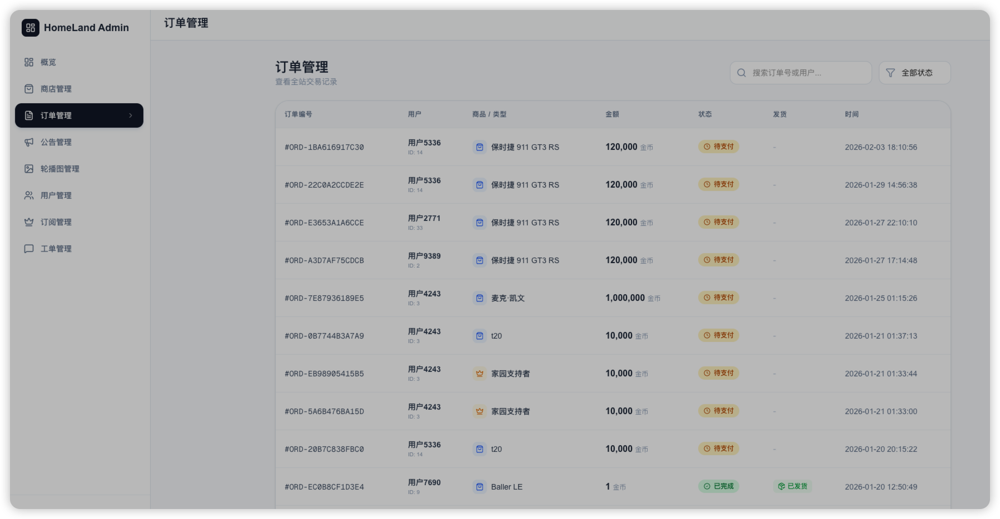
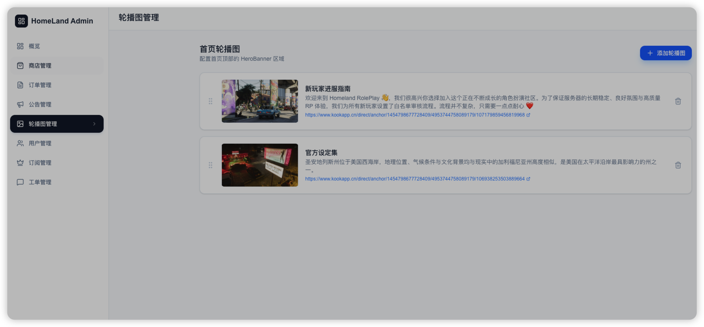
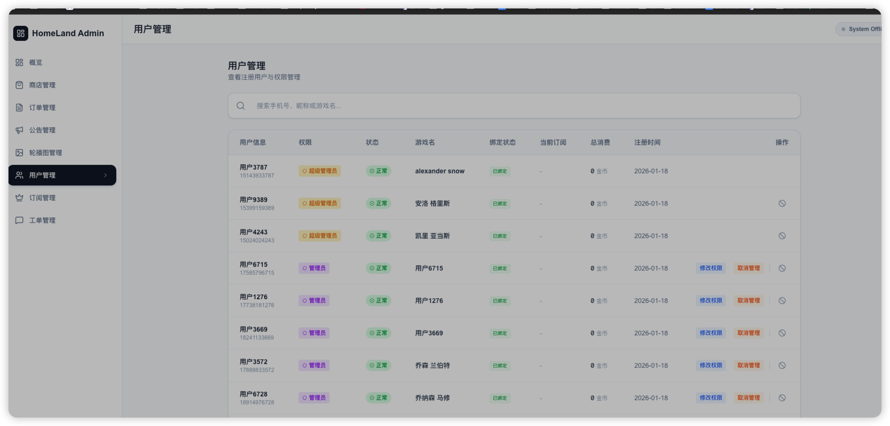
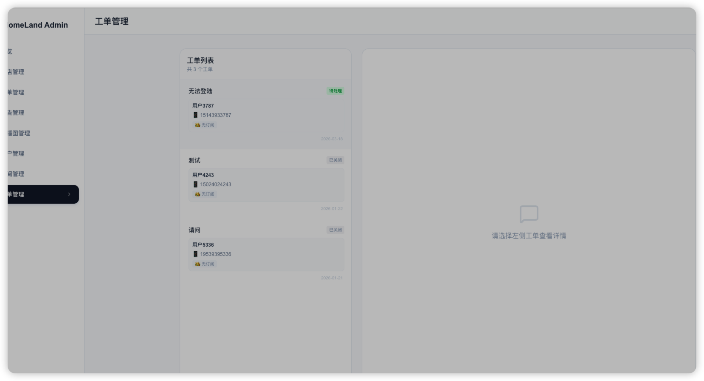

---

## ⚙️ 功能特点

- 🎮 FiveM 加载界面适配
- 📢 公告系统（支持自定义）
- 🎨 现代化 UI 设计
- ⚡ 轻量级前端（加载快）
- 🔧 易于修改和二次开发
- 🌐 支持本地 / CDN 部署

---

## 📦 项目结构

```
fivem-start-web/
│
├── public/            # 静态资源
│   ├── ishot-*.png    # 项目截图
│   ├── images/
│   ├── icons/
│
├── src/               # 源代码
│   ├── components/
│   ├── pages/
│   ├── assets/
│
├── index.html
├── package.json
└── README.md
```

---

## 🚀 快速开始

### 1️⃣ 克隆项目

```bash
git clone https://github.com/ferbylv/fivem-start-web.git
cd fivem-start-web
```

### 2️⃣ 安装依赖

```bash
npm install
```

### 3️⃣ 启动项目

```bash
npm run dev
```

### 4️⃣ 打包构建

```bash
npm run build
```

---


## 🛠️ 自定义修改

你可以根据自己的服务器进行以下修改：

- 修改公告内容
- 替换 UI 风格（颜色 / 背景）
- 添加服务器特色展示
- 替换背景音乐
- 接入 API（玩家数据 / 排行榜）

---

## 💡 使用场景

- 不删档内测公告页
- 服务器品牌展示页
- 加载动画 UI
- 玩家进入前引导界面

---


## ❤️ 支持 & 反馈

如果你觉得这个项目不错：

- ⭐ 点个 Star
- 🐛 提交 Issue
- 🔧 提交 PR


